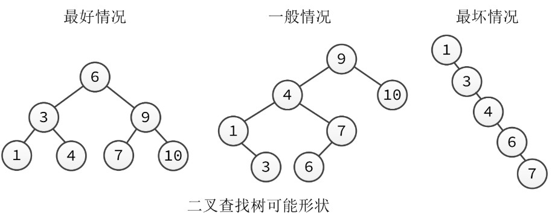
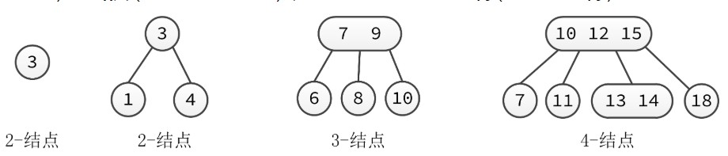
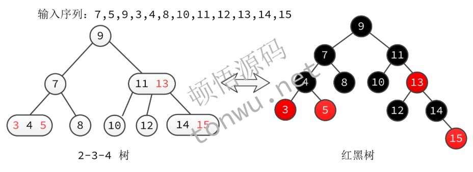

### 二叉查找树
红黑树的由来要从二叉查找树说起。二叉查找树是一颗二叉树，它每个结点的值都大于其左子树的任意结点而小于右子树的任意结点，它结合了链表插入的灵活性和有序数组查找的高效性（二分查找）。

对于使用二叉查找树的算法，它的运行时间取决于树的形状，
而树的形状又取决于结点插入的先后顺序。如上图所示，最好情况下，N 个结点的树是完全平衡的，每条空链接到根结点的距离都为 ~lgN；而在最坏的情况下，搜索路径上可能有 N 个结点，退化成了链表。

所以，为了保证运行时间始终在对数级别，在动态构建二叉查找树时，希望保持其平衡性，也就是降低树的高度，使其尽可能为 ~lgN，这样就能保证所有的查找都能在 ~lgN 次比较内结束，就像二分查找那样，这样的树被称为平衡二叉查找树。

### AVL 树
第一个自平衡二叉查找树就是AVL 树，它规定，每个结点的左右子树的高度之差不超过 1。在插入或删除结点，打破平衡后，就会通过一次或多次树旋转来重新平衡。

AVL 树是严格平衡的，适用于查找密集型应用程序，因为在频繁插入或删除结点的场景下，**它花费在树旋转的代价太高。**

而红黑树就是一种折中方案，它不追求完美平衡，只求部分达到平衡，从而降低在调整时树旋转次数。

### 2-3-4 树

说到红黑树，就不得不提 2-3-4 树，因为，红黑树可以说就是它的一种特殊实现，对它有所了解，非常有助于理解红黑树。

保持平衡，无非是为了降低树的高度，如果把二叉查找树一般化，允许一个结点保存多个值，变成多叉树，也可认为是降低了高度。

确切地说，标准二叉查找树中的结点称为2-结点（一个值两个子结点），现在引入3-结点（两个值三个子结点）和4-结点（三个值四个子结点），这样就能得到一颗 2-3-4 树（也称为 2-4 树）。

2-3-4 树是 4 阶 B 树，所有数据按排序顺序保存，所有叶子结点都在相同的深度。对于大多数编程语言，直接实现 2-3-4 树比较困难，而红黑树的实现相对要简单容易，这也是红黑树应用广泛的一部分原因。

红黑树是二叉树，所有的结点都是2-结点，所以为了能够表示3-结点和4-结点，为结点引入了颜色属性：

黑色，表示普通结点
红色，表示可与父结点合并看作多值结点
如上图所示，如果把红黑树的红色结点和其父结点放平，它的结构就和左边的 2-3-4 树一样。

### 红黑树
现在，来看下红黑树的性质：

- 每个结点都是红色或黑色的
- 根结点是黑色的（是红色最终也会转黑色）
- 所有叶子结点都是黑色的，这里的叶子结点指的是空结点，常用 NIL 表示
- 如果结点为红色，则其子结点均为黑色（红色表示可与父结点合并，子结点凑什么热闹）
- 从给定结点到其任何后代 NIL 结点的每条路径都包含相同数量的黑色节点（转成 2-4 树，所有叶子节点均在最底层）
这些性质不必去背，就算记住后也绝对会忘，应该结合着 2-3-4 树理解性记忆。

另外，红黑树中的旋转和颜色翻转，就相当于 2-3-4 树中的拆分和合并，并且 2-3-4 树结点的拆分和合并，理解起来相当简单。对比分析和理解红黑树的操作，绝对让你眼前一亮。

